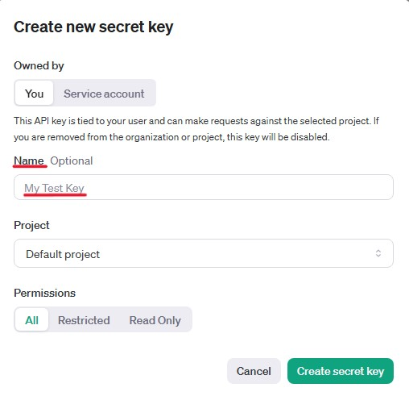
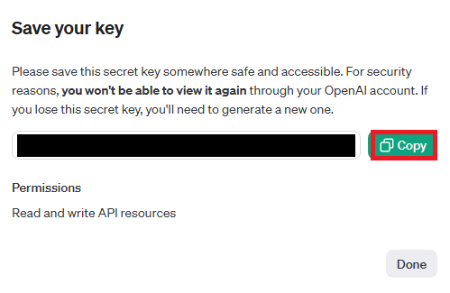
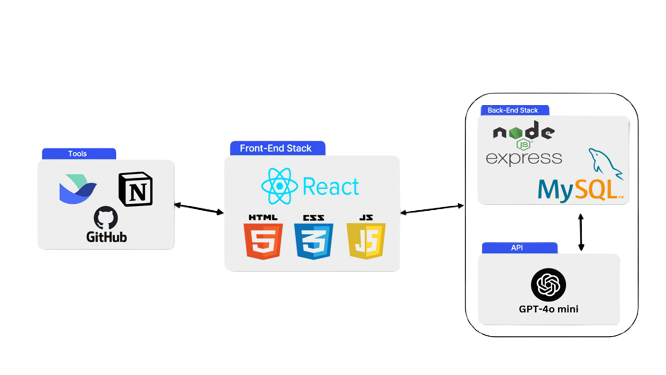
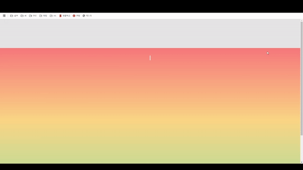
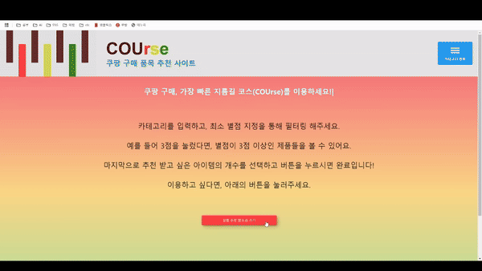
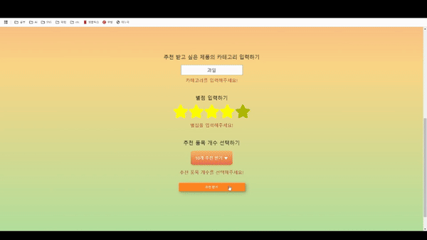

# COUrse

## 🖌 Description
>현대 사회에서 시간은 가장 중요한 자원 중 하나로 여겨지며, 특히 젊은 세대는 시간 절약과 효율성을 중시하는 소비 패턴을 보이고 있습니다. 이러한 배경에서 탄생한 ‘시성비(시간 대비 성능 비율)’ 트렌드는 다양한 산업 분야에서 큰 주목을 받고 있습니다.

>COUrse는 이러한 트렌드에 발맞춰 ‘쿠팡 구매 품목 추천 시스템’을 제작하는 것을 목표로 합니다. 이 시스템은 사용자 맞춤형 추천 알고리즘을 통해 쇼핑 시간을 대폭 줄이고, 효율적인 구매 결정을 돕는 것을 목적으로 합니다.

## 🔧 How to Run

❗ 본 프로젝트를 사용하기에 앞서 DB 데이터 저장 및 OpenAI API키가 필요합니다.

**Step 1.** 본 프로젝트를 git clone을 통하여 복제 합니다.

```bash
git clone https://github.com/minggichae/COUrse.git
```

**Step 2.** BackEnd 폴더안에 .env 파일을 만듭니다.

**Step 3.** .env 파일 안에 다음과 같이 작성합니다.

- ✨ .env 파일 안에 해당되는 변수들은 다음과 같이 확인 할 수 있습니다.

  - `GPT_API_KEY`

    - OpenAI 홈페이지에 접속 후 로그인을 합니다.
    - 우측 상단의 톱니바퀴 모양(Settings)를 누르고, API keys에 들어갑니다.
    - 초록색의 Create new sercret key를 클릭합니다.
    - Name에다가 API Key 이름을 적고 Create secret key를 클릭하여 다음 창에서 Copy 버튼을 통해 복사를 한 후 .env 파일에다가 옮겨 적습니다.

      
      

  - `DB_HOST`, `DB_USER`, `DB_PASSWORD`, `DB_NAME`
    - MySQL Workbench를 설치를 합니다.
      (참고: [MySQL Workbench 설치](https://giveme-happyending.tistory.com/203#article-3--%F0%9F%92%BB-mysql-%EC%84%A4%EC%B9%98) )
    - 설치 후 Local instance MySQL에 접속한 후 DB_README.md를 참고하여 입력합니다. (참고: [DB_README.md 바로가기](https://github.com/minggichae/COUrse/blob/main/src/BackEnd/DB_README.md) )
    - 입력을 한 후 .env 파일에 옮겨 적으면 됩니다.

```env
GPT_API_KEY=복사한 OpenAI API 키
DB_HOST=localhost
DB_USER=사용자명
DB_PASSWORD=비밀번호
DB_NAME=DB명
```

**Step 4.** npm ci를 통하여 모듈을 다운받고, vscode 터미널 2개에서 다음과 같이 실행합니다.

- 첫번째 터미널(서버 실행)

```
npm ci
npm run build
cd src/BackEnd
node server.js
```

- 두번째 터미널(프로젝트 실행)
  - ❗ 첫번째 터미널을 먼저 실행한 후 실행해야합니다.

```
npm run start
```

## ⛓️ Service Architecture



## 📱 APP Screenshot

### 이미지 1: 메인 페이지, 카테고리



사이트의 이용 방법과 카테고리 버튼을 통해 입력할 수 있는 카테고리의 종류(현재 과일, 채소만 입력가능)를 확인할 수 있습니다.

---

### 이미지 2: 상품 정보 입력



상품에 대한 정보를 입력 후 추천을 받습니다.

---

### 이미지 3: 상품 추천



추천 받기 버튼을 통해 상품을 추천받고, 상품 이미지 클릭 시 쿠팡 구매 사이트로 연결됩니다.
재추천 버튼을 통해 재추천 받을 수 있습니다.

## 🚨 R&R

- 채민기[BE/팀장]: ProductResult, ProductUrls, server
- 곽지훈[FE/팀원]: 프론트엔드 아키텍처와 주요 로직 설계 및 컴포넌트 개발(Explanation, Header, Footer, Product, Layout, Dropdown, Hamburger, Star, App), framer-motion와 npm 라이브러리를 활용한 CSS 스타일링, UI/UX 개선  
